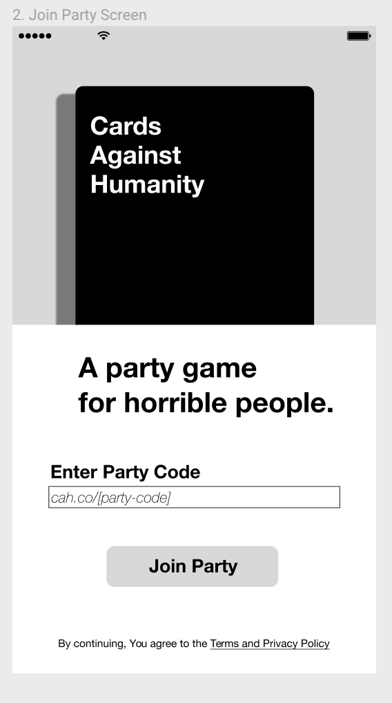
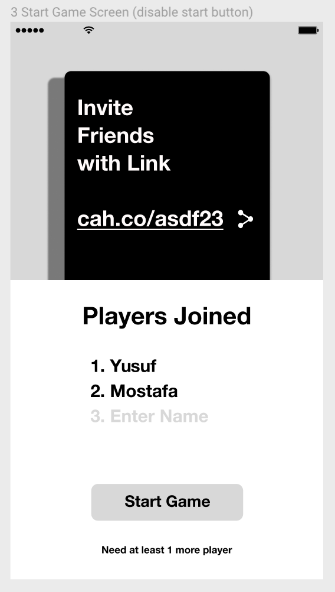
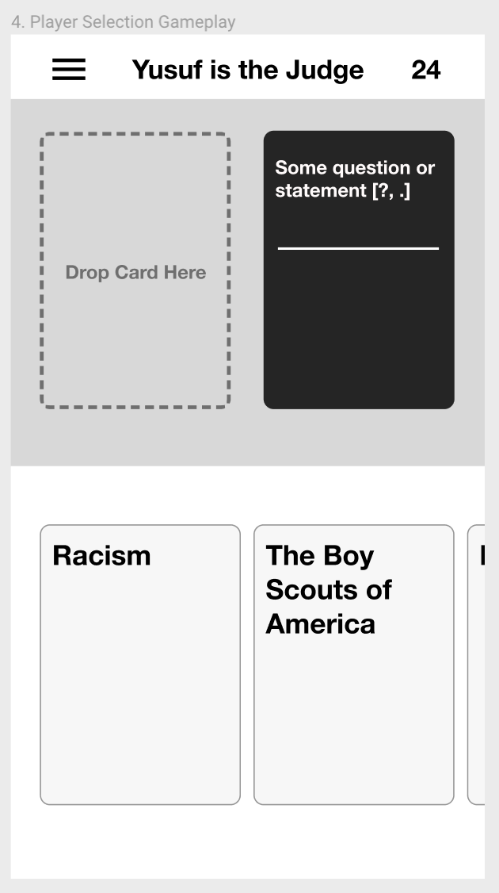
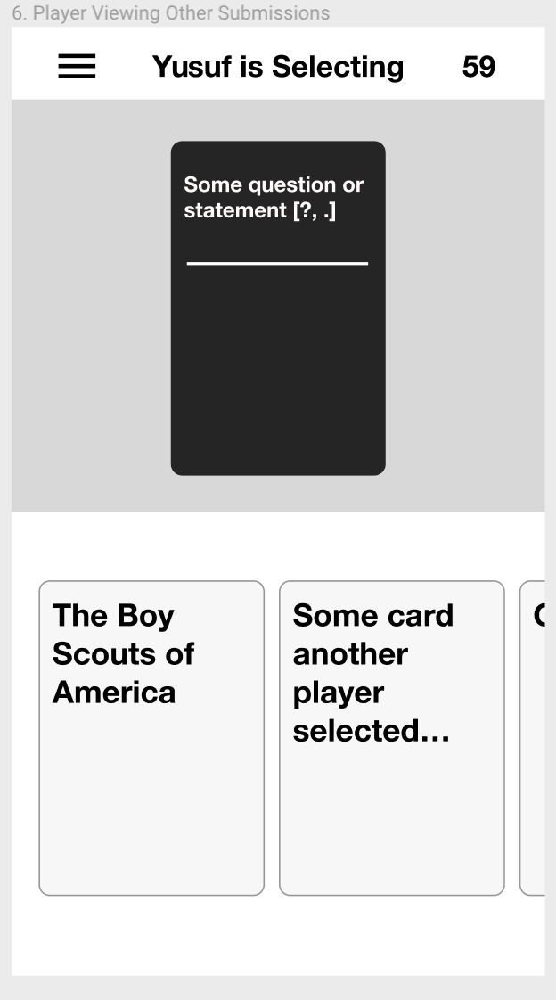
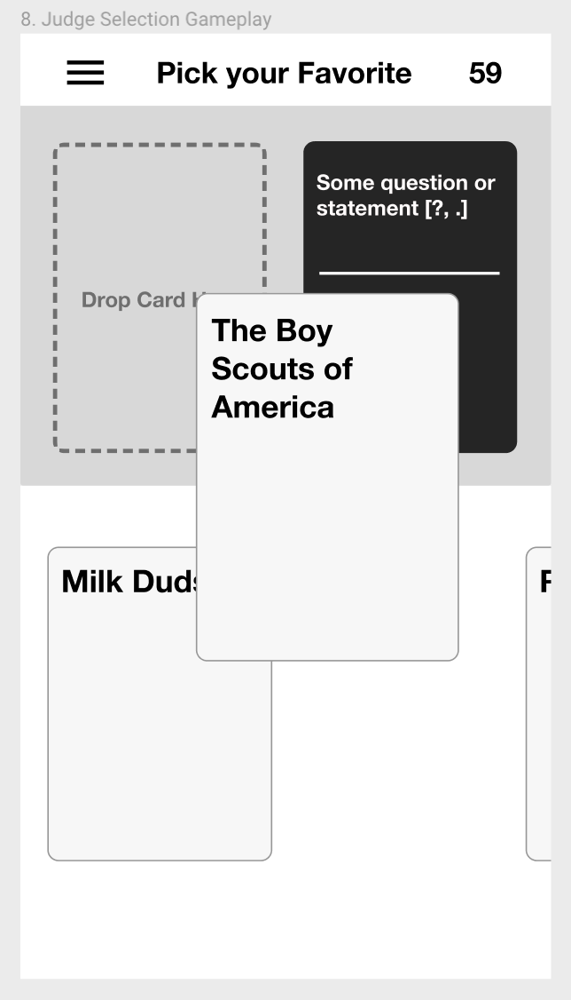
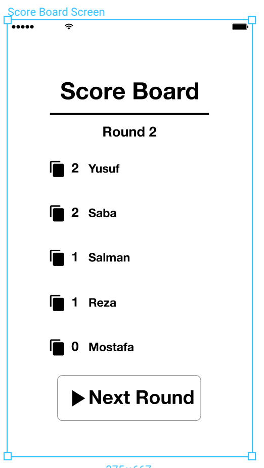

# Welcome to Cards Against Humanity on Mobile!
This project represents a mobile version of the popular party card game we all know and love, "**Cards Against Humanity!**"

The game is simple! The person who plays the funniest card wins! For more info on intricate versions of the game, checkout the [official rulebook](https://s3.amazonaws.com/cah/CAH_Rules.pdf) from the creators.

Although this game will be available to play online, it is meant to be played in person with friends, for those times we forget to carry that 5 lb brick of cards :P

## Developing Roadmap
### Iteration 1:
The first iteration of this project will be released in the form of a mobile game, experienced via a users mobile web browser (Chrome/Firefox for most Android users, and Safari for most iOS users). The game will be cross platform and available to play for anyone, free of charge, as long as they have an internet connection and a group of friends to play with! This has the immediate benefit that users who have different phone's can play with each other without having to wait for their version of the app to be released. 
### Iteration 2:
I hope to offer this game natively on the App Store and Android Play Store (with react-native) under a different name, due to licensing, once I have created the basic web version.

## Proposed Tech Stack
These are the preliminary tech stacks that I have planned to use, subject to change.
### Frontend
1. React.js
2. Vanilla CSS
3. Socket.io

### Backend
1. Node.js (Express.js)
2. Socket.io
3. Redis (for fast, in memory real time game state data)
4. MongoDB (for longer term game history data)

### Infrastructure
As a Microsoft Dev, I have become intimately familiar with Microsoft Azure and the different Paas and Iaas offerings that we offer. However, I would like to explore building this out using different Paas infrastructures such as products from AWS or even Heroku. I have not done much research in this regard, but would like to have this project be an opportunity to compare and contrast what is out there and how it compares to Azure.

## Current Project Progress
I hope to keep this section of the readme as up to date as possible as the project progresses. As of today, 1/14/19, the initial wire-frames have been created and prototyped via [Figma](https://www.figma.com/file/0Tg73m0IZNdbAh9hmAk5Sh10/Cards-Against-Humanity?node-id=0%3A1). I am currently building out the react (presentational) components for each of the wire-frame screens as well as exploring npm packages to allow for fluidity and drag-and-drop behaviors for the app. After I have finished transferring the design to react components, I will begin exploring the data transfer model and backend logic for game creation and game flow.

## Extra goodies and features
Although the basic mvp of this project need not be complicated, here are a few extra goodies that can make the app shine!

* facebook/instagram login
* facebook/instagram sharing capability
* save card play to local images
* user gameplay reaction (w/Emoji's :))
* Add different game modes as described in the [handbook](https://s3.amazonaws.com/cah/CAH_Rules.pdf)

## Wireframes
Take a look at the [Figma](https://www.figma.com/file/0Tg73m0IZNdbAh9hmAk5Sh10/Cards-Against-Humanity?node-id=0%3A1) created and try out the prototype option to see the game in action before its created!

Below are some Screenshots and the story board for user interactions:

#### 1. User enters the site from mobile browser

#### 2a. User Creates a party

#### 2b. User Joins an existing party

#### 3a. Round Starts and User is NOT the Card Czar
User will select/drag-and-drop their best/funniest white card based on the current black card in play.  

#### 3.a The Card Czar sees a "Waiting Screen"
Nothing much for them to do but wait...  

#### 4a. Round finishes and everyone views the white cards played

#### 4b. Judge chooses their favorite card

#### 5. Round Winner is Chosen!

#### 6. Round Restarts and Everyone sees the Scoreboard

___

###### Disclaimer:
After I had made a few initial wireframes for this project, I researched and found out that a similar idea, called Cards Against Originality, existed some years ago. It's hard to find any remnants of this project online, but as for the licensing purposes, Cards Against Humanity is under the Creative Commons licenses and as such, I do not intend to make money of this project or sell it in any way. This is purely for educational purposes.
